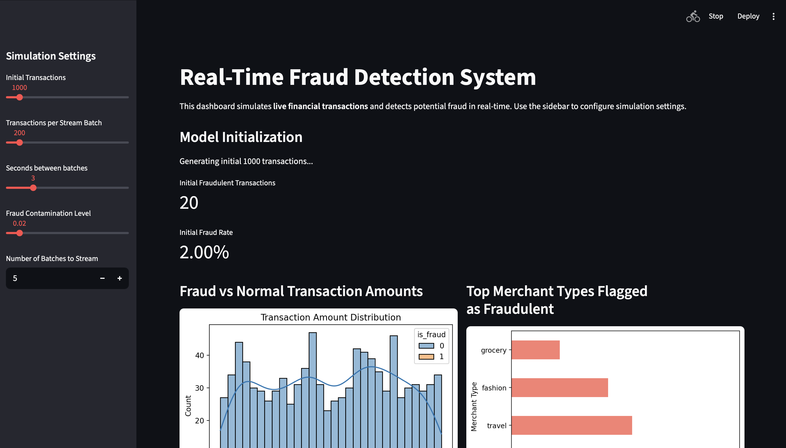
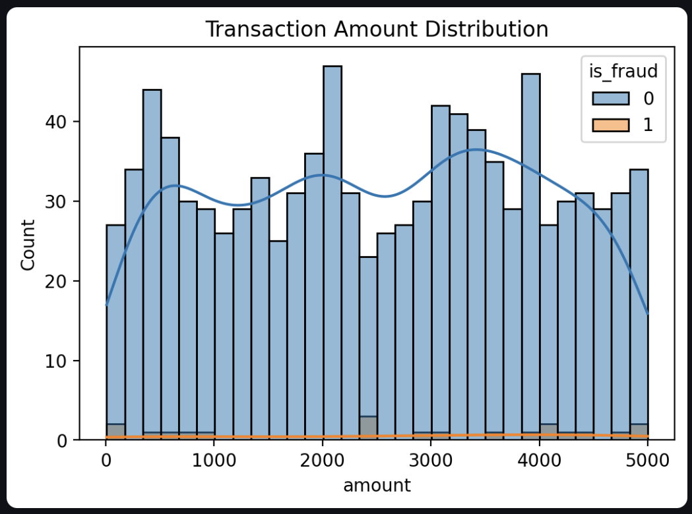
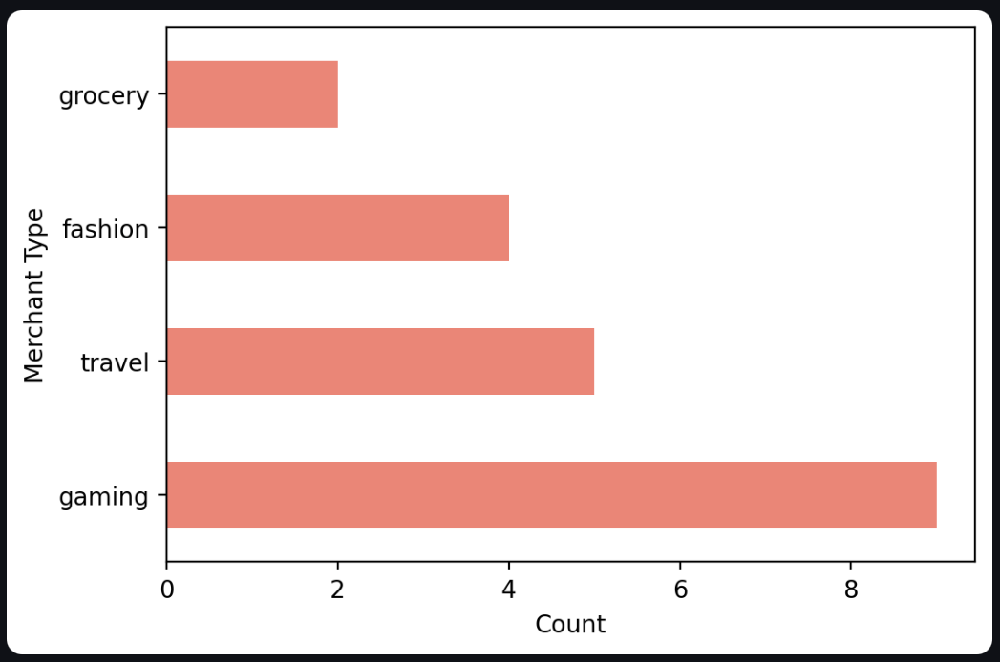
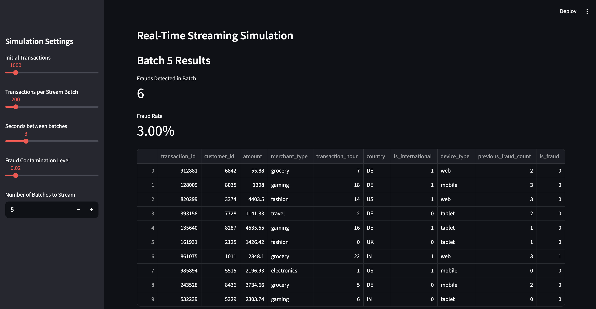
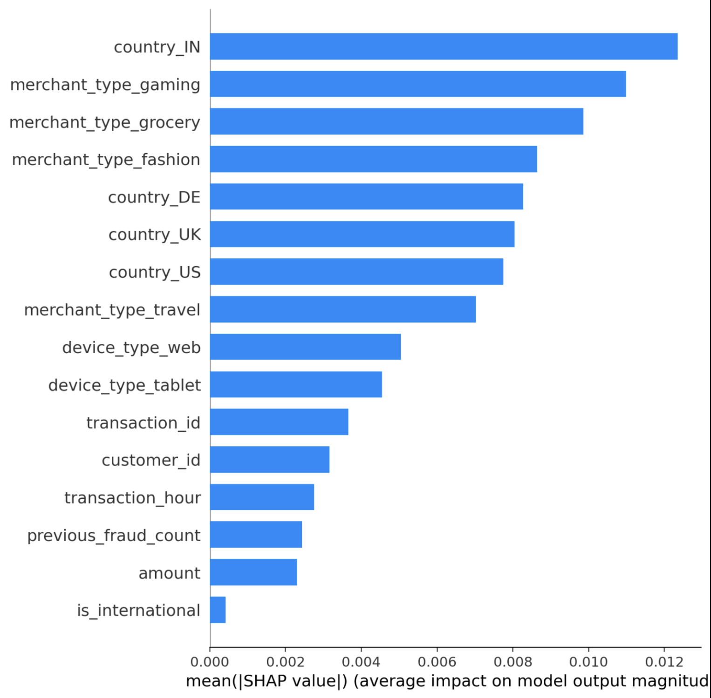

## Overview

This project simulates **real-time financial transactions** and detects **potentially fraudulent behavior** using machine learning and explainable AI.  
The system combines **PySpark streaming**, **Scikit-Learn anomaly detection**, and **SHAP interpretability** within an interactive **Streamlit dashboard**.

### Objective
To build an end-to-end fraud detection pipeline that:
- Simulates live financial transaction streams  
- Preprocesses and encodes data dynamically  
- Trains an **Isolation Forest** model to detect anomalies  
- Evaluates transactions in real-time via streaming batches  
- Provides model transparency using SHAP feature importance  

---

## Why It Matters
Real-time fraud detection is critical for **fintech** and **e-commerce** platforms to:
- Prevent financial loss through proactive anomaly detection  
- Enable explainable, auditable ML-driven decision systems  
- Support scalable deployment with distributed streaming data  

---

## Key Features

| Feature | Description |
|----------|-------------|
| **Transaction Simulation** | Generates synthetic transaction data (merchant type, country, device, amount) |
| **Streaming Detection** | Simulates real-time data ingestion and scoring in live batches |
| **Model Training** | Uses Scikit-Learn’s `IsolationForest` for unsupervised anomaly detection |
| **Explainability (SHAP)** | Visualizes feature contributions and top fraud indicators |
| **Streamlit Dashboard** | Provides interactive fraud monitoring and explainability views |
| **PySpark Structured Streaming** | Demonstrates large-scale streaming ingestion and inference at scale |
| **Modular Codebase** | Reusable scripts under `/src` for data generation, preprocessing, and modeling |

---

## Repository Structure
```
real-time-fraud-detection-system/
├── images/                            # Screenshots and demo visuals for README
│   ├── dashboard_overview.png
│   ├── streaming_batches.png
│   └── shap_explainability.png
├── notebooks/
│   └── fraud_detection.ipynb          # End-to-end notebook walkthrough
├── src/
│   ├── data_simulation.py             # Transaction generator
│   ├── preprocessing.py               # Encoding & feature scaling
│   ├── model_training.py              # Model training & prediction
│   ├── explainability.py              # SHAP-based model interpretability
│   └── pyspark_stream_simulation.py   # PySpark structured streaming pipeline
├── streamlit_app.py                   # Interactive Streamlit dashboard
├── requirements.txt                   # Dependencies
├── requirements.lock                  # Frozen package versions for reproducibility
├── README.md                          # Project documentation
└── .gitignore
```
**Dashboard Includes:**
- Real-time fraud detection simulation  
- Fraud count and rate KPIs  
- Fraudulent merchant-type distribution  
- SHAP feature importance and top feature table  

---

---

## Results Summary

| Metric | Result |
|--------|--------|
| **Total Transactions (Training)** | 1,000 |
| **Flagged as Fraudulent** | ~2% |
| **Streaming Batches** | 5 simulated batches |
| **Average Fraud Count per Batch** | ~7 |

**Example Output:**
```
Batch 1: 9 potential frauds detected.
Batch 2: 5 potential frauds detected.
Batch 3: 8 potential frauds detected.
Batch 4: 9 potential frauds detected.
Batch 5: 4 potential frauds detected.
```

---

## Visualizations

### 1. Streamlit Dashboard Overview


### 2. Transaction Amount Distributions


### 3. Fraudulent Merchant Breakdowns


### 4. Real-Time Streaming Simulation


### 5. SHAP Explainability



---

## Technologies Used

**Languages:**  
Python, SQL (potential integration)

**Libraries & Packages:**  
`pandas`, `numpy`, `scikit-learn`, `matplotlib`, `seaborn`, `tqdm`, `shap`, `pyspark`, `streamlit`

**Techniques:**  
Anomaly Detection, Real-Time Streaming, Explainable AI, Feature Engineering

**Environments:**  
VS Code, JupyterLab, Streamlit, PySpark

---

## End-to-End Architecture
1. **Data Simulation:** Synthetic transactions are generated continuously.  
2. **Preprocessing:** Features are one-hot encoded and scaled.  
3. **Model Inference:** Isolation Forest detects anomalies.  
4. **Streaming Loop:** Transactions are processed in micro-batches.  
5. **Explainability:** SHAP quantifies which features drive fraud risk.  
6. **Visualization:** Streamlit dashboard displays live metrics and model insights.  
